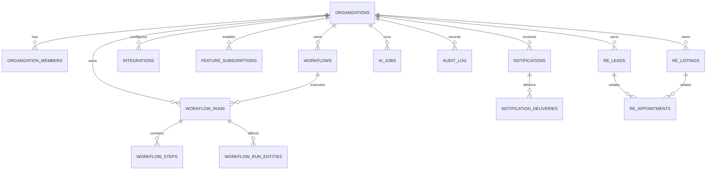

# Platform core and vertical modules

The platform core owns tenant isolation, integrations, workflow execution, notifications, AI jobs, reporting, and generic audit history. Industry-specific records live in separate schemas and are referenced by generic workflow entity links.

## Entity relationship diagram

## Migration order

1. Existing baseline and client-service migrations remain unchanged.
2. `20260714000001_real_estate_workflow_operations.sql` is the historical real-estate implementation.
3. `20260714000002_platform_core_and_vertical_modules.sql` backfills organizations, adds organization ownership, creates reusable platform tables, moves real-estate records into `real_estate`, and installs the generic ingestion RPC.
4. `20260714000003_fix_generic_ingest_legacy_bridge.sql` repairs the compatibility write into the legacy `automation_runs` table, whose existing event index is partial.

The repository migrations remain the source of truth. The Supabase MCP may execute a migration in bounded chunks when its large-DDL request timeout is triggered; the SQL chunks must still be taken directly from the migration file.

## Data migration

- Each existing client receives one organization with `vertical_key = 'real_estate'`.
- The existing client user becomes the organization owner.
- Existing tenant tables receive and backfill `organization_id`.
- Existing real-estate rows are copied to `real_estate.leads`, `real_estate.listings`, and `real_estate.appointments` before the old public tables are removed.
- Existing `automation_runs` rows remain available to the dashboard and gain a link to canonical `workflow_runs` for new ingested executions.
- No operational rows are invented for empty staging tables.

## Security and performance

- All tenant-owned core and vertical tables carry `organization_id`, timestamps, and RLS.
- Authenticated reads use organization membership; service-role-only functions handle trusted ingestion.
- `audit_log` has no client-facing write policy, making it append-only for application users.
- External identity uniqueness is scoped by organization and source system.
- Indexes cover workflow execution time, entity lookup, integration health, notifications, reports, AI jobs, audit history, and vertical lifecycle queries.

## Extension rule

New industries should add a schema such as `healthcare`, `legal`, or `property_management` and register their records through `workflow_run_entities` using a new `vertical_key`. Core workflow, audit, notification, AI, and integration tables must not gain industry-specific enums or foreign keys.
